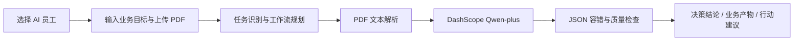

# ResearchOS

> 面向科研团队的 AI 科研创新决策平台。

ResearchOS 是用于比赛展示与校招实践的科研组织智能平台原型。它保留单篇深度分析能力，并增加团队论文库、多论文 RAG 知识问答、结构化研究报告、引用证据和可解释执行摘要。

本项目用于比赛展示，不是生产系统；不虚构用户数量、准确率、商业收入或企业落地案例。

## ResearchOS 平台定位

ResearchOS 不是简单的 PDF 总结工具，而是面向高校实验室、科研机构和企业研究院的科研组织智能平台原型。团队以研究目标、已沉淀资料和分析任务驱动 Agent：先理解问题，再规划检索策略，筛选论文证据，并生成可复核的研究结论与报告。

当前版本以 PDF 论文资料为已实现知识资产入口，保留 SQLite 论文库、RAG 问答历史和研究报告历史。论文原文与索引存放在本地 `work/` 目录，不会上传到前端。专利、实验报告、项目资料的统一分类管理属于后续演进方向。

真实限制保持不变：无 OCR、无生产级数据库或向量数据库服务，且为非生产系统。

## ResearchOS 多 Agent 工作流

```text
科研负责人输入目标 + 团队知识库资料
                ↓
Research Master（理解需求、选择专项 Agent、生成执行计划）
                ↓
Literature / Knowledge / Trend / Innovation / Project Agent
                ↓
Report Agent（整合证据，生成科研决策辅助报告）
```

- **Literature Agent**：归纳研究背景、技术路线、实验方法与局限。
- **Knowledge Agent**：检索当前团队已上传并索引的资料，提供章节级证据。
- **Trend Agent**：仅从团队已有资料中归纳热点、演进和待验证方向，不宣称外部实时文献结论。
- **Innovation Agent**：根据资料不足与未覆盖问题提出需要专家验证的创新机会。
- **Project Agent**：将横向需求转成技术匹配、研究任务和潜在成果路径建议。
- **Report Agent**：把专项输出组织为背景、趋势、创新机会、技术路线、成果规划和验证建议。

该实现是轻量的可解释编排层：Research Master 真实调度既有检索与 Qwen 调用，专项输出共享同一批检索证据；并非声称多个独立模型服务在后台并行运行。

## 科研项目与 FDE 交付闭环

ResearchOS 增加了一个轻量的横向项目展示链路：

```text
企业需求 → 项目创建 → 知识库证据检索 → Project Agent 能力匹配
        → 技术路线建议 → 论文 / 专利方向 → 阶段性成果规划
```

- **客户需求中心**：保存企业需求、研究目标、技术路线、论文规划、专利规划和成果管理状态。
- **Project Agent**：基于当前实验室资料输出能力匹配、技术方案建议、预期成果路径与待确认风险。
- **Value Agent**：从当前资料覆盖角度，辅助评估研究热度、创新潜力和成果潜力；不代表外部市场热度或成功概率。
- **Lab Profile**：按需归纳研究方向、核心能力、已有成果线索和潜在合作方向，需由实验室负责人核验。
- **科研 BI**：展示本地科研资产分布、技术路线、成果规划漏斗和覆盖度指标。图表使用本地数据，不是外部实时行业统计。

## RAG v3 科研知识能力

```text
PDF → 解析文本 → Chunk → DashScope Embedding → FAISS
问题 → Research Planner → Query Rewrite → Hybrid Retrieval → Rerank
     → Qwen-plus 基于证据回答 → 引用、检索质量与执行摘要
```

- **论文库**：SQLite 保存论文元数据、解析文本、知识片段、报告和历史问答；API 不返回完整论文文本。
- **Deep Analysis**：保留原有单篇论文分析与连续追问。
- **Knowledge Retrieval**：支持多论文问答，返回章节级片段引用、证据等级和检索质量。
- **Research Report**：支持论文综述、研究趋势、研究空白报告；综述包含研究背景、核心问题、技术路线、方法比较、创新点、不足、未来研究方向和参考论文。
- **Agent Trace**：`agent_traces` 保存“分析问题、制定任务、检索、筛选证据、生成结论”等用户可理解的执行摘要；不保存模型内部思维链、API Key 或请求鉴权信息。

详情见 [架构文档](docs/architecture.md)、[API 文档](docs/api.md) 和 [Demo 指引](docs/demo.md)。

## 产品定位

科研人员处理大量论文时，不仅需要阅读摘要，还要跨论文定位证据、比较方法路线、识别研究空白，并组织可复查的研究报告。

```text
研究问题 + 论文资料 + 分析目标
            ↓
任务规划、Query Rewrite 与知识检索
            ↓
Qwen-plus 基于引用证据生成结论
            ↓
研究报告、检索质量与人工复核入口
```

## 三个 AI 员工

| AI 员工 | 典型资料 | 业务产物 |
| --- | --- | --- |
| AI售前顾问 | 客户需求、企业技术方案 | 客户沟通方案：关注点、方案优势、可能问题、推荐回答与下一步沟通动作 |
| AI产品经理 | 竞品资料、产品文档、需求文档 | 产品策略报告：用户痛点、产品机会、功能建议与优先级 |
| AI技术专家 | 科研论文、技术方案、专利资料 | 技术评审报告：技术路线、技术优势、风险与优化方向 |

支持的文档场景保持为 `paper`、`technical_document`、`product_document`。角色会影响提示词重点、业务工作流和最终产物的组织方式。

## Agent 工作流



页面展示 `agent_workflow` 与 `agent_trace` 两类可解释执行摘要。它们描述实际代码中的任务规划、PDF 解析、模型调用和规则校验步骤；不展示模型内部思维链。

## 核心能力

- 多角色工作空间：AI售前顾问、AI产品经理、AI技术专家。
- 业务目标驱动：以“请输入你的目标”替代单纯的分析任务输入。
- 结构化结果：保留 `analysis`、`decision_report`、`business_report`、`quality_check` 等已有字段。
- 业务产物：新增 `deliverables`，按角色组织客户沟通方案、产品策略报告或技术评审报告。
- 行动中心：新增 `action_center`，提供立即行动、待确认问题与推荐任务；同时保留兼容字段 `action_plan`。
- 可信度中心：`trust_report` 提示信息依据、不确定性与验证建议；`confidence_score` 只是字段覆盖的规则评分，不代表事实准确率。
- 章节级依据：`evidence_cards` 关联关键结论与文档章节提示，方便人工复核。
- 连续追问：分析后可对当前内存中的文档进行最近三轮上下文追问。
- 基础 PWA：包含 manifest 与 service worker，可在支持的浏览器中作为基础应用入口安装；不改变后端能力。

## 返回兼容性

旧接口字段继续保留：`analysis`、`result`、`summary`、`decision_report`、`business_report`、`trust_report`、`evidence_cards`、`quality_check`、`agent_trace`、`decision_reason` 与 `execution_plan`。

新增字段均有稳定默认结构：

- `agent_workflow`：用户目标、角色、规划说明和用户可理解工作流步骤；
- `deliverables`：当前角色对应的业务产物；
- `action_center`：`next_actions`、`questions_to_verify`、`recommended_tasks`；
- `action_plan`：兼容字段 `immediate_actions`、`follow_up_questions`、`recommended_next_steps`。

## 技术架构

```text
Vue 3 CDN 静态页面
        ↓ HTTP
FastAPI
 ├─ PaperAnalysisAgent：单篇论文分析与连续追问
 └─ ResearchAgent：任务规划、检索、重排与报告
        ↓
SQLite + DashScope Embedding + FAISS + Qwen-plus
```

## 项目结构

```text
app/
  main.py                    # FastAPI 路由、CORS 与异常映射
  agent/
    paper_agent.py           # Agent 编排、工作流、业务产物与行动中心
    scenario_config.py       # 场景和 AI 员工角色配置
    research_agent.py        # 多论文 RAG 问答与报告
    research_planner.py      # 科研任务识别与策略
    research_master_agent.py # ResearchOS 多 Agent 任务编排
  services/
    llm_service.py           # DashScope 调用、JSON 容错、质量检查
    pdf_service.py           # PDF 文本提取
    chunking_service.py      # 论文片段切分
    embedding_service.py     # DashScope Embedding
    retrieval_service.py     # Hybrid Retrieval
    rerank_service.py        # 候选证据重排
    agent_trace_service.py   # 用户可见执行摘要
    rag_evaluation_service.py # 检索质量评估
  routes/
    research.py              # 论文库、RAG 和报告接口
    researchos.py            # 科研驾驶舱、Agent 中心与多 Agent 任务接口
frontend/
  index.html                 # Vue CDN 页面与 PWA 入口
  app.js                     # 工作空间状态、后端调用与结果展示
  styles.css                 # 响应式产品样式
  manifest.json              # 基础 PWA 清单
  service-worker.js          # 静态应用壳缓存
docs/
  architecture.md            # 架构说明
  api.md                     # API 概览
  demo.md                    # 演示步骤
```

## 本地运行

```powershell
py -m venv .venv
.\.venv\Scripts\Activate.ps1
pip install -r requirements.txt
```

在根目录创建 `.env`（不得提交）：

```env
DASHSCOPE_API_KEY=your_api_key_here
LLM_BASE_URL=https://dashscope.aliyuncs.com/compatible-mode/v1
LLM_MODEL=qwen-plus
EMBEDDING_MODEL=text-embedding-v4
EMBEDDING_DIMENSIONS=1024
```

启动后端和静态前端：

```powershell
.\.venv\Scripts\python.exe -m uvicorn app.main:app --host 127.0.0.1 --port 8000
py -m http.server 5173 --directory frontend
```

打开 `http://127.0.0.1:5173`；健康检查为 `http://127.0.0.1:8000/health`。

## 3分钟演示流程

1. 在“我的论文库”上传多篇可提取文本的真实论文 PDF，等待状态为 `ready`。
2. 进入“知识问答”，输入“比较不同论文的方法路线”。
3. 查看 Agent 执行过程、检索质量、带章节提示的引用证据和回答。
4. 在“研究任务中心”生成论文综述报告。
5. 打开历史知识问答，恢复此前的回答和引用。

演示模式只预填角色、场景与业务目标，不生成虚假文档分析数据；结果必须来自实际上传 PDF 和后端调用。

## 功能截图位置

比赛截图可放置于 `docs/screenshots/`。建议包含：论文库的 `ready` 状态、知识问答的 Agent Trace 与检索质量卡片、引用来源详情、论文综述报告和历史问答列表。

## Render 部署

仓库根目录的 `render.yaml` 定义了一个 FastAPI Web Service：

- Build Command：`pip install -r requirements.txt`
- Start Command：`uvicorn app.main:app --host 0.0.0.0 --port $PORT`
- Health Check：`/health`

在 Render 创建 Blueprint 或 Web Service 后，在服务的 **Environment** 中设置以下变量：

```text
DASHSCOPE_API_KEY=<在 Render 控制台填写，不要写入仓库>
LLM_BASE_URL=https://dashscope.aliyuncs.com/compatible-mode/v1
LLM_MODEL=qwen-plus
EMBEDDING_MODEL=text-embedding-v4
EMBEDDING_DIMENSIONS=1024
```

`DASHSCOPE_API_KEY` 在 `render.yaml` 中通过 `sync: false` 声明，Render 会要求在控制台单独填写，不会保存到 Git。部署完成后访问 `https://<你的后端域名>/health`，应返回 `{"status":"ok"}`。

前端可作为 Render Static Site 部署 `frontend/` 目录。但静态前端的 API 地址和 FastAPI CORS 允许来源必须对应实际的 Render 域名；如果创建新的服务域名，需要在部署前同步检查这两项配置。

## 当前限制

- 不使用 LangChain、Chroma、Milvus、Redis 或生产级向量数据库；多论文 RAG 使用 SQLite + 本地 FAISS，适合小规模 Demo。
- 向量索引会在论文上传或删除后整体重建，不适合高并发生产环境。
- 免费 Render Web Service 的本地文件系统是临时的，因此 `work/` 中的 SQLite、上传 PDF 与 FAISS 索引不能作为生产持久化方案。服务重启或重新部署后，论文库可能需要重新建立。
- 无 OCR，仅支持能由 `pypdf` 提取文字的 PDF。
- 单次模型输入最多取前 20,000 个字符。
- 论文库、切片、RAG 问答与分析报告保存在本地 SQLite；服务重启后可恢复。单篇临时上传分析的连续追问上下文仍保存在服务进程内存中。
- `evidence_cards` 仅为章节级提示，不是精确页码、段落级引用或原文溯源。
- RAG 引用为论文片段和章节级提示；`retrieval_quality` 仅反映检索匹配，不代表回答事实准确率。
- 业务产物和行动建议是辅助信息，仍需结合访谈、现场环境、数据或专家判断验证。
- PWA 仅提供基础安装与静态壳缓存，并非离线文档分析能力。
