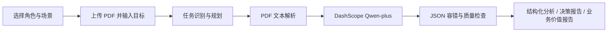

# AI Insight Agent

> 企业知识洞察与决策支持助手 · 企业 AI Agent 产品原型

AI Insight Agent 是一个面向帆软 AI 产品体验设计挑战赛展示的轻量级企业 AI Agent 原型。用户上传可提取文本的 PDF，选择业务角色和分析场景后，Agent 将文档内容转化为结构化分析、决策支持报告与业务价值报告。

## 比赛展示版本

本项目面向企业 AI 应用场景设计：Agent 理解用户目标，根据角色调整分析策略，并将非结构化文档转换为结构化决策建议。它强调“从信息阅读到决策辅助”的产品体验，而不把模型输出包装为未经验证的业务结论。

### 产品故事

企业每天产生大量技术文档、方案资料和产品材料，人工阅读成本高，关键信息不易快速提取。AI Insight Agent 模拟企业专家的分析流程，帮助研发、产品和售前等不同岗位快速理解资料，并形成可继续验证的决策辅助信息。

项目沿用简洁技术栈：Vue 3 CDN、FastAPI、`PaperAnalysisAgent`、`pypdf` 与阿里云百炼 DashScope OpenAI-compatible API（`qwen-plus`）。它不是生产系统，也不包含 RAG、向量数据库、多 Agent 或持久化数据库。

## 产品场景

| 用户角色 | 适用场景 | Agent 关注点 |
| --- | --- | --- |
| 研发人员 | 科研论文、技术方案、专利资料 | 技术路线、核心创新、技术风险、后续研究建议 |
| 产品经理 | 竞品资料、产品资料、需求文档 | 用户需求、产品价值、功能机会、竞争差异 |
| 售前顾问 | 客户需求、解决方案文档 | 需求理解、方案匹配、实施风险、沟通建议 |

当前支持三个分析场景：`paper`、`technical_document` 与 `product_document`。用户角色会传入后端，并影响 Agent 的提示词重点和业务报告视角。

## Agent 工作流



返回结果保留已有 `analysis`、`result`、`decision_report`、`summary`、`decision_reason` 与 `execution_plan` 字段，并新增：

- `user_role`、`role_name`：实际传入的用户角色；
- `business_report`：决策摘要、重要发现、业务机会、风险、推荐行动与预期价值；
- `quality_check`：完整度、风险/建议存在性、缺失信息与 0–100 分；
- `evidence_sources`：章节级证据提示。当前未实现精确页码或段落定位，页面会明确标注这一限制。

## 最新产品体验能力

### agent_trace：可解释执行摘要

`agent_trace` 展示本次 Agent 的可解释执行过程，包括：

- 用户目标；
- 用户角色；
- 分析策略；
- 已使用能力与执行步骤。

页面不展示模型内部思维链，只展示与实际代码流程对应的执行摘要，帮助用户理解 Agent 如何完成文档分析。

### trust_report：结果可信度辅助信息

`trust_report` 用于提示结果的使用边界，包括：

- 信息依据；
- 不确定性；
- 验证建议。

其中 `confidence_score` 是基于结构化结果字段覆盖和缺失信息计算的规则评分，不代表模型输出的事实准确率。

### evidence_cards：章节级依据提示

`evidence_cards` 将关键结论与其关联的文档章节提示一起展示，并标注支持程度。

当前能力不是精准页码引用，也不是原文段落级溯源；章节提示用于帮助用户回到文档的相关内容进行复核。

### business_report：业务价值报告

`business_report` 面向决策辅助输出以下内容：

- 决策摘要；
- 重要发现；
- 业务机会；
- 风险；
- 推荐行动；
- 预期价值。

报告根据用户角色和文档场景组织表达，用于辅助后续判断，不替代人工业务决策。

## 项目结构

```text
app/
  main.py                    # FastAPI 路由与异常映射
  agent/
    paper_agent.py           # Agent 编排、任务规划、角色与证据提示
    scenario_config.py       # 场景和用户角色的轻量配置
  services/
    llm_service.py           # DashScope 调用、JSON 容错、质量检查
    pdf_service.py           # PDF 文本提取
frontend/                    # Vue 3 CDN 产品原型页面
```

## 本地运行

1. 创建并激活 Python 虚拟环境，安装依赖：

```powershell
py -m venv .venv
.\.venv\Scripts\Activate.ps1
pip install -r requirements.txt
```

2. 在项目根目录创建 `.env`，不要提交该文件：

```env
DASHSCOPE_API_KEY=your_api_key_here
LLM_BASE_URL=https://dashscope.aliyuncs.com/compatible-mode/v1
LLM_MODEL=qwen-plus
```

3. 启动后端和前端：

```powershell
.\.venv\Scripts\python.exe -m uvicorn app.main:app --host 127.0.0.1 --port 8000
py -m http.server 5173 --directory frontend
```

打开 `http://127.0.0.1:5173`，选择角色、场景，上传 PDF 并输入分析目标即可开始。后端健康检查为 `http://127.0.0.1:8000/health`。

## 当前限制

- 仅支持通过 `pypdf` 提取出文字的 PDF；扫描件暂不支持 OCR。
- 单次模型输入最多取前 20,000 个字符。
- 当前文档和最近三轮问答只保存于进程内存中，服务重启后需重新上传。
- 证据来源只提供章节级提示，并不声称精确页码或段落定位。
- 分析质量、可用额度和速度取决于文档内容、百炼账户权限、模型服务和网络条件。

## 产品体验设计思路

### 用户痛点

企业的技术方案、竞品资料和客户需求文档通常信息密度高、阅读成本高。使用者不仅需要“看懂资料”，还需要识别风险、机会和下一步行动。

### AI 解决方案

用户先选择业务角色和场景，再输入目标。`PaperAnalysisAgent` 根据这些真实输入选择提示词重点、规划执行步骤、调用 PDF 解析与 Qwen-plus，并返回可展示的执行摘要。页面不展示模型内部思维链。

### 产品价值

产品将信息获取升级为决策辅助：除了结构化分析，还提供业务价值报告、规则化可信度中心、章节级证据提示与待验证建议。所有“时间节省”和“决策辅助”描述均为定性说明，不包含虚构比例、准确率或收益数据。

## 后续方向

- 引入可追溯的段落/页码级引用；
- 为长文档增加检索与知识库能力；
- 增加多文档对比、持久化会话与更完整的评测集。
