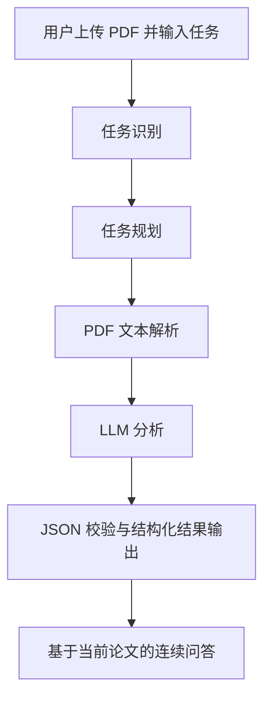

# AI科研文献分析 Agent

一个面向个人校招展示的独立 Agent 应用场景实践项目。项目使用 FastAPI、Vue 3 CDN、PDF 文本提取与阿里云百炼 Qwen，实现对单篇科研论文的任务驱动式分析与连续追问。

> 项目采用轻量级单 Agent 工作流，不使用 LangChain、LangGraph、RAG、向量数据库、多 Agent 或持久化数据库。

## 1. 项目背景

科研人员阅读论文时，常需要在较短时间内梳理研究主题、问题、实验方法、创新点与局限性。相关信息通常分散在摘要、方法、实验和结论等章节中，人工提取与归纳成本较高；在阅读多篇论文时，这种理解成本会进一步累积。

本项目以“用户任务驱动”的方式组织论文分析：用户上传一篇可提取文本的 PDF 并说明关注点，由 Agent 理解任务、选择分析模板、调用论文解析与大模型能力，最后返回结构化结果。它用于辅助初步理解论文，不替代人工学术评审。

## 2. 项目介绍

这是一个基于 Agent 工作流的科研文献分析助手。

用户上传论文并提出分析任务后，Agent 能够：

- 理解用户需求并识别一个或多个分析任务；
- 生成与实际代码流程对应的执行计划；
- 调用 PDF 文本解析与 DashScope 大模型分析能力；
- 校验模型返回的 JSON，并输出稳定的结构化论文分析结果；
- 保存当前论文文本和最近 3 轮问答上下文，支持继续追问。

## 3. Agent工作流程



实际执行中，`PaperAnalysisAgent` 会先识别任务类型，再解析 PDF、在内存中保存当前论文上下文，组合已有提示词模板并调用一次模型，最后校验结构化结果。

## 4. Agent核心能力

### 任务识别

Agent 根据用户输入的关键词识别任务，并可组合多个分析重点。当前支持：

- 摘要总结；
- 创新点分析；
- 实验方法 / 研究方法分析；
- 主要结论与局限性分析；
- 论文整体分析；
- 论文问答。

例如，用户输入“请总结这篇论文，并分析创新点和实验方法”时，Agent 会识别 `summary`、`innovation` 与 `experiment` 三个任务，并组合相应提示词进行一次结构化分析。

### 决策流程展示

分析接口会返回以下真实决策信息，前端据此展示“Agent执行过程”：

- `detected_tasks`：识别出的任务列表；
- `decision_reason`：选择任务组合的原因；
- `execution_plan`：与实际代码执行对应的计划步骤。

同时保留 `paper_id`、`task_type`、`analysis`、`result` 与 `summary` 等结果字段，便于兼容页面展示和后续追问。

### 上下文问答

首次分析后，后端使用 `paper_id` 关联当前论文文本；用户可以继续针对研究方法、实验设计或结论提问。每篇论文仅在内存中保留最近 3 轮问答，以控制上下文长度。

## 5. 技术架构

```text
Vue 3 CDN 前端
      ↓ HTTP
FastAPI
      ↓
PaperAnalysisAgent
  ├── PDF 解析（pypdf）
  └── DashScope OpenAI-compatible API（qwen-plus）
      ↓
JSON 结构化结果
      ↓
Vue 页面展示与继续追问
```

## 6. 技术实现

- **FastAPI 后端**：提供健康检查、论文分析和追问接口，并映射 PDF、任务和模型调用异常为中文提示。
- **Vue 3 CDN 前端**：不依赖 Vite 或大型 UI 框架，负责文件上传、任务输入、Agent 决策过程、结构化结果和对话展示。
- **大模型 API 调用**：通过 OpenAI Python SDK 调用阿里云百炼的 OpenAI-compatible 接口；API Key 仅从 `DASHSCOPE_API_KEY` 环境变量读取。
- **Agent Workflow 设计**：`PaperAnalysisAgent` 负责任务识别、决策说明、执行计划、PDF/LLM 服务编排与当前论文会话管理。
- **PDF 文本解析**：使用 `pypdf` 提取文本，并处理空文件、非 PDF、无法解析和无文本等异常。
- **JSON 结构化输出**：模型按固定字段返回 JSON；后端可清理 Markdown JSON 代码块并校验字段。结果包含 `title`、`research_topic`、`research_question`、`methodology`、`key_findings`、`innovation_points`、`limitations`、`keywords`。

## 7. 项目部署

代码通过 GitHub 管理，部署架构保持简单：

```text
GitHub main
  ├── Render Web Service：FastAPI 后端
  └── Render Static Site：Vue 3 CDN 前端
```

后端在 Render 中使用以下启动方式：

```bash
uvicorn app.main:app --host 0.0.0.0 --port $PORT
```

部署时，在 Render 后端服务的环境变量中配置：

```env
DASHSCOPE_API_KEY=your_api_key_here
LLM_BASE_URL=https://dashscope.aliyuncs.com/compatible-mode/v1
LLM_MODEL=qwen-plus
```

不要提交 `.env`、真实 API Key 或包含敏感信息的论文文件。线上前端域名需要加入 FastAPI 的 CORS 白名单。

本地运行时，可分别启动：

```powershell
.\.venv\Scripts\python.exe -m uvicorn app.main:app --host 127.0.0.1 --port 8000
py -m http.server 5173 --directory frontend
```

## 8. 项目限制

- 当前论文文本与问答上下文保存在 FastAPI 进程内存中；服务重启、实例休眠或扩容后需要重新上传论文。
- 仅支持可通过 `pypdf` 提取文字的 PDF，扫描型或图片型 PDF 没有 OCR 支持。
- 单次发送给模型的论文文本最多取前 20,000 个字符，超出部分不会参与该次分析。
- 任务识别采用关键词与固定模板的轻量级策略，不是开放式自主规划系统。
- 当前未加入向量数据库检索、RAG 或论文知识库。
- 模型调用效果、可用额度和响应速度受百炼账户权限、模型服务与网络环境影响。

## 9. 后续优化方向

- 增加 RAG 知识检索，为长论文和多篇论文对比提供更细粒度上下文；
- 增加论文知识库与持久化会话能力；
- 支持综述生成、论文对比、研究路线梳理等更多科研场景；
- 为扫描型 PDF 增加 OCR；
- 增加自动化测试与持续集成，提升部署后的回归验证效率。
