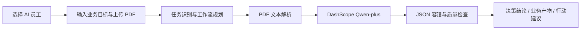

# AI Insight Agent

> 企业AI员工工作空间（Enterprise AI Employee Workspace）原型

AI Insight Agent 是一个面向企业资料理解与业务准备的轻量级 AI Agent 原型。用户选择 AI 员工角色、输入业务目标并上传可提取文本的 PDF 后，系统将资料转化为结构化分析、可复核的决策辅助信息和下一步行动建议。

本项目用于比赛展示，不是生产系统；不虚构用户数量、准确率、商业收入或企业落地案例。

## 比赛展示版本说明

AI Insight Agent 不是简单的 PDF 总结工具，而是面向企业岗位的 AI 员工原型。用户以岗位角色、业务目标和企业资料驱动 Agent：先理解要完成的任务，再规划可解释的执行流程，分析可提取文本的文档知识，并生成业务结果、待验证问题与后续行动建议。

比赛展示版增加了浏览器本地的 AI 员工档案与任务历史、快捷业务任务入口、角色化业务产物和基础 PWA 入口。历史信息只保存在当前浏览器的 `localStorage`，不会上传到服务端，也不构成持久化企业知识库。

真实限制保持不变：无 RAG、无数据库、无 OCR，且为非生产系统。

## 产品定位

企业人员处理技术资料、产品材料与客户方案时，通常需要完成具体业务任务，而不仅是阅读总结：准备技术交流、开展产品评审或评估技术方案。

```text
AI 员工角色 + 业务目标 + 文档资料
            ↓
任务理解与工作流规划
            ↓
PDF 文本解析与 Qwen-plus 分析
            ↓
业务产物、行动中心与可信度提示
```

## 三个 AI 员工

| AI 员工 | 典型资料 | 业务产物 |
| --- | --- | --- |
| AI售前顾问 | 客户需求、企业技术方案 | 客户沟通方案：关注点、方案优势、可能问题、推荐回答与下一步沟通动作 |
| AI产品经理 | 竞品资料、产品文档、需求文档 | 产品策略报告：用户痛点、产品机会、功能建议与优先级 |
| AI技术专家 | 科研论文、技术方案、专利资料 | 技术评审报告：技术路线、技术优势、风险与优化方向 |

支持的文档场景保持为 `paper`、`technical_document`、`product_document`。角色会影响提示词重点、业务工作流和最终产物的组织方式。

## Agent 工作流



页面展示 `agent_workflow` 与 `agent_trace` 两类可解释执行摘要。它们描述实际代码中的任务规划、PDF 解析、模型调用和规则校验步骤；不展示模型内部思维链。

## 核心能力

- 多角色工作空间：AI售前顾问、AI产品经理、AI技术专家。
- 业务目标驱动：以“请输入你的目标”替代单纯的分析任务输入。
- 结构化结果：保留 `analysis`、`decision_report`、`business_report`、`quality_check` 等已有字段。
- 业务产物：新增 `deliverables`，按角色组织客户沟通方案、产品策略报告或技术评审报告。
- 行动中心：新增 `action_center`，提供立即行动、待确认问题与推荐任务；同时保留兼容字段 `action_plan`。
- 可信度中心：`trust_report` 提示信息依据、不确定性与验证建议；`confidence_score` 只是字段覆盖的规则评分，不代表事实准确率。
- 章节级依据：`evidence_cards` 关联关键结论与文档章节提示，方便人工复核。
- 连续追问：分析后可对当前内存中的文档进行最近三轮上下文追问。
- 基础 PWA：包含 manifest 与 service worker，可在支持的浏览器中作为基础应用入口安装；不改变后端能力。

## 返回兼容性

旧接口字段继续保留：`analysis`、`result`、`summary`、`decision_report`、`business_report`、`trust_report`、`evidence_cards`、`quality_check`、`agent_trace`、`decision_reason` 与 `execution_plan`。

新增字段均有稳定默认结构：

- `agent_workflow`：用户目标、角色、规划说明和用户可理解工作流步骤；
- `deliverables`：当前角色对应的业务产物；
- `action_center`：`next_actions`、`questions_to_verify`、`recommended_tasks`；
- `action_plan`：兼容字段 `immediate_actions`、`follow_up_questions`、`recommended_next_steps`。

## 技术架构

```text
Vue 3 CDN 静态页面
        ↓ HTTP
FastAPI → PaperAnalysisAgent
        ├─ PDF 文本解析（pypdf）
        ├─ 任务/场景/角色配置
        ├─ DashScope OpenAI-compatible API（qwen-plus）
        └─ JSON 容错、证据提示、规则质量检查
```

## 项目结构

```text
app/
  main.py                    # FastAPI 路由、CORS 与异常映射
  agent/
    paper_agent.py           # Agent 编排、工作流、业务产物与行动中心
    scenario_config.py       # 场景和 AI 员工角色配置
  services/
    llm_service.py           # DashScope 调用、JSON 容错、质量检查
    pdf_service.py           # PDF 文本提取
frontend/
  index.html                 # Vue CDN 页面与 PWA 入口
  app.js                     # 工作空间状态、后端调用与结果展示
  styles.css                 # 响应式产品样式
  manifest.json              # 基础 PWA 清单
  service-worker.js          # 静态应用壳缓存
```

## 本地运行

```powershell
py -m venv .venv
.\.venv\Scripts\Activate.ps1
pip install -r requirements.txt
```

在根目录创建 `.env`（不得提交）：

```env
DASHSCOPE_API_KEY=your_api_key_here
LLM_BASE_URL=https://dashscope.aliyuncs.com/compatible-mode/v1
LLM_MODEL=qwen-plus
```

启动后端和静态前端：

```powershell
.\.venv\Scripts\python.exe -m uvicorn app.main:app --host 127.0.0.1 --port 8000
py -m http.server 5173 --directory frontend
```

打开 `http://127.0.0.1:5173`；健康检查为 `http://127.0.0.1:8000/health`。

## 3分钟演示流程

1. 点击“3分钟体验Demo”，自动选择 AI售前顾问与企业技术文档场景，并填充客户交流目标。
2. 上传一份可提取文本的真实 PDF，开始分析。
3. 依次查看 AI决策结论、AI员工执行过程、业务产物、下一步建议、可信度中心和详细分析。
4. 点击“查看问题 TOP 5”，得到与当前角色匹配的人工业务交流准备问题。
5. 在页面底部继续追问当前文档。

演示模式只预填角色、场景与业务目标，不生成虚假文档分析数据；结果必须来自实际上传 PDF 和后端调用。

## 当前限制

- 无 RAG、向量数据库、持久化数据库或多 Agent 编排。
- 无 OCR，仅支持能由 `pypdf` 提取文字的 PDF。
- 单次模型输入最多取前 20,000 个字符。
- 文档和最近三轮追问仅保存在服务进程内存中，重启后需要重新上传。
- `evidence_cards` 仅为章节级提示，不是精确页码、段落级引用或原文溯源。
- 业务产物和行动建议是辅助信息，仍需结合访谈、现场环境、数据或专家判断验证。
- PWA 仅提供基础安装与静态壳缓存，并非离线文档分析能力。
