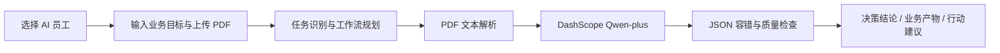

# ResearchOS

## Overview

ResearchOS is an enterprise AI operating workspace for governed research, solution delivery and reviewable AI work.

## Problem and Solution

It connects customer needs to planning, multi-agent execution, evidence, human review, delivery and approved knowledge memory without treating AI drafts as verified enterprise knowledge.

## Architecture

AI Workspace → Copilot → Mission Engine → Planner → Agent Runtime → Evidence / Artifact / Human Review / Governance / Knowledge Memory.

## RAG Evidence and Security

RAG references remain traceable. Prompts, chain-of-thought, secrets and unapproved customer materials are not exposed as enterprise knowledge. Demo flows are explicitly `DEMO_ONLY`.

> **AI Research Operating System · AI 科研决策与执行平台**

ResearchOS 是面向高校实验室、科研机构、企业研发团队与产学研协作场景的 AI 产品原型。它以一个明确的研究目标为起点，把授权资料、AI 研究、Evidence、人工确认、项目执行与成果交付组织为同一条可追溯的科研闭环。

## P34 Enterprise Deployment Runtime

P34 adds a bounded production-runtime layer around the existing Mission, Governance and Evidence workflows. It does not replace the RAG pipeline or authorize autonomous research decisions.

```text
Frontend container → Backend API → SQLite-compatible state / FAISS index
                         ↘ Agent Worker → queued Mission → Human Review
```

- **Configuration management**: `ConfigService` reads model, database, storage and security settings from environment variables and only returns redacted configuration summaries.
- **Task runtime**: `RuntimeTask` records `QUEUED → RUNNING → SUCCESS | FAILED | WAITING_REVIEW`; `AgentWorker` applies a finite retry policy (default: 3) and routes exhausted failures to human review.
- **Storage boundary**: generated runtime artifacts use `StorageProvider`; LOCAL is implemented and `S3_COMPATIBLE` is deliberately configuration-only until an approved adapter is supplied.
- **Operational visibility**: `/health` and `/api/runtime/monitor` expose database, storage, worker and vector-store health without prompts, model reasoning or secrets.

### Container deployment

1. Copy `.env.example` to a private `.env` and provide deployment secrets only through the host or secret manager. Do not commit `.env`.
2. Start the stack: `docker compose up --build`.
3. Open the frontend at `http://localhost:8080`; the API is available at `http://localhost:8000`.
4. Verify `GET /health`, `GET /api/runtime/health` and `GET /researchos/diagnostics` before accepting workloads.

The compose `database` service is an optional future external-database boundary (`external-db` profile). The current application remains SQLite-compatible, with state stored in the `researchos_state` volume. Generated files and the local FAISS/index state remain outside Git.

### Production checklist

- Configure `DASHSCOPE_API_KEY` in the deployment secret store only; never place a real key in source, README or image layers.
- Set `DATABASE_URL`, `STORAGE_PROVIDER`, `STORAGE_ROOT`, `RUNTIME_MAX_RETRIES`, `WORKER_POLL_SECONDS` and `REQUIRE_HUMAN_REVIEW` for the target environment.
- Persist the state volume and back it up under the organization’s data-retention policy.
- Keep the worker separate from the API process and monitor queue length, retry count and `WAITING_REVIEW` tasks.
- Confirm RBAC, Audit Log and Agent Policy controls for every workspace before allowing connector access.

```text
Research Goal → Knowledge → AI Research → Evidence → Decision
              → Human Review → Project → Tasks → Deliverables → Knowledge Asset
```

它不是聊天机器人，也不把 PDF 总结作为产品终点：ResearchOS 的核心是帮助科研团队以有资料依据、可复核、由人确认的方式推进研究与协作。

核心能力包括：

- **Multi-Agent**：Research Master 编排文献、知识、趋势、创新、项目与报告专项能力。
- **Research Worker Agent Loop**：以受控工具完成任务理解、规划、执行、观察、评估与待人工确认的交付物。
- **RAG + FAISS**：基于已上传并索引的资料进行多论文知识检索与研究问答。
- **Evidence + Human-in-the-loop**：以章节级资料提示支撑建议；没有资料时明确提示不足，建议须由负责人确认。
- **FDE Solution Delivery Workflow**：覆盖客户需求、方案设计、模块映射、实施计划、测试、验收与交付演练。

本项目用于比赛展示与校招实践，不是生产系统；不虚构用户数量、准确率、商业收入或企业落地案例。

## 产品入口与用户任务

产品面向用户的主入口收敛为：**Research Command、Knowledge Space、Research Projects、Tasks、Evidence、Deliverables、FDE Delivery、System**。Research Master、Research Worker 与专项 Agent 是执行层能力，而非要求用户理解的后台导航。

- **Research Command**：先定义目标、资料范围、计划步骤、所需工具与预期交付，再实际发起研究任务。
- **Knowledge Space**：管理已授权上传并完成解析/索引的科研资料；资料不足时，系统明确提示不能形成有依据的研究结论。
- **Evidence / Human Review**：重要建议可回溯到已有资料的章节级 Evidence；采纳、修改或拒绝由研究人员确认。
- **Projects / Tasks / Deliverables**：把确认后的研究建议组织成项目、执行事项与待审核成果，而不是把 AI 输出伪装成最终科研事实。
- **FDE Delivery**：以明确标注的 Demo Scenario 演练“客户需求 → 方案 → 实施 → 测试 → 验收 → 交付”，不代表真实客户或商业合同。

## ResearchOS 平台定位

ResearchOS 不是简单的 PDF 总结工具，而是面向高校实验室、科研机构和企业研究院的科研组织智能平台原型。团队以研究目标、已沉淀资料和分析任务驱动 Agent：先理解问题，再规划检索策略，筛选论文证据，并生成可复核的研究结论与报告。

当前版本以 PDF 论文资料为已实现知识资产入口，保留 SQLite 论文库、RAG 问答历史和研究报告历史。论文原文与索引存放在本地 `work/` 目录，不会上传到前端。专利、实验报告、项目资料的统一分类管理属于后续演进方向。

真实限制保持不变：无 OCR、无生产级数据库或向量数据库服务，且为非生产系统。

## ResearchOS 多 Agent 工作流

```text
科研负责人输入目标 + 团队知识库资料
                ↓
Research Master（理解需求、选择专项 Agent、生成执行计划）
                ↓
Literature / Knowledge / Trend / Innovation / Project Agent
                ↓
Report Agent（整合证据，生成科研决策辅助报告）
```

- **Literature Agent**：归纳研究背景、技术路线、实验方法与局限。
- **Knowledge Agent**：检索当前团队已上传并索引的资料，提供章节级证据。
- **Trend Agent**：仅从团队已有资料中归纳热点、演进和待验证方向，不宣称外部实时文献结论。
- **Innovation Agent**：根据资料不足与未覆盖问题提出需要专家验证的创新机会。
- **Project Agent**：将横向需求转成技术匹配、研究任务和潜在成果路径建议。
- **Report Agent**：把专项输出组织为背景、趋势、创新机会、技术路线、成果规划和验证建议。

该实现是轻量的可解释编排层：Research Master 真实调度既有检索与 Qwen 调用，专项输出共享同一批检索证据；并非声称多个独立模型服务在后台并行运行。

## 科研项目与 FDE 交付闭环

ResearchOS 增加了一个轻量的横向项目展示链路：

```text
企业需求 → 项目创建 → 知识库证据检索 → Project Agent 能力匹配
        → 技术路线建议 → 论文 / 专利方向 → 阶段性成果规划
```

- **客户需求中心**：保存企业需求、研究目标、技术路线、论文规划、专利规划和成果管理状态。
- **Project Agent**：基于当前实验室资料输出能力匹配、技术方案建议、预期成果路径与待确认风险。
- **Value Agent**：从当前资料覆盖角度，辅助评估研究热度、创新潜力和成果潜力；不代表外部市场热度或成功概率。
- **Lab Profile**：按需归纳研究方向、核心能力、已有成果线索和潜在合作方向，需由实验室负责人核验。
- **科研 BI**：展示本地科研资产分布、技术路线、成果规划漏斗和覆盖度指标。图表使用本地数据，不是外部实时行业统计。

## v1.1 科研决策闭环

ResearchOS v1.1 将 AI 输出明确定位为需要人工确认的科研决策辅助，而不是自动执行的科研结论：

```text
企业需求 / 科研目标
        ↓
知识库检索与 Multi-Agent 分析
        ↓
Evidence（已上传资料的论文 / 文件 / 章节 / 匹配度）
        ↓
AI Action（行动建议 + rationale + evidence_refs）
        ↓
Human Decision（待确认 / 已采纳 / 已修改 / 已拒绝）
        ↓
Research Project → Outcome（论文 / 专利 / 技术报告 / 实验成果）
```

- **Evidence first**：行动建议只保存对已有证据的轻量引用，不复制论文全文；没有资料依据时界面明确显示“暂无可验证资料”。
- **rationale**：说明建议来自哪些已展示的资料与 Agent 输出，供负责人理解与复核；不暴露模型思维链、内部 Prompt 或接口日志。
- **Human-in-the-loop**：采纳、修改或拒绝均由用户确认，不由 AI 自动代替科研负责人决策。
- **成果可追溯**：Outcome 通过 `source_action_id` 回溯到来源行动；删除项目会清理其临时项目级 Action、Decision 与 Outcome，避免孤儿记录。

系统已实现真实科研资料的上传、解析、索引、RAG 与决策闭环代码路径，并提供独立端到端验收脚本：

```powershell
.\.venv\Scripts\python.exe scripts/e2e_researchos_test.py `
  --question "请比较已上传论文中明确描述的研究方法差异" `
  --goal "基于已上传资料梳理可进一步人工验证的研究方向"
```

该脚本只使用用户已授权上传的资料；没有真实资料时会输出“等待用户上传真实科研PDF”并停止。当前仓库不声明已完成真实科研资料的端到端验收。

## v3 自主科研 AI 员工

ResearchOS v3 将 v2 的受控自主执行能力升级为 **AI Research Worker**：它不替代科研负责人，而是在一个可解释、可复核的循环中完成目标理解、真实工作区感知、任务规划、允许工具调用、结果观察、资料覆盖检查、下一步重规划和交付物整理。

```text
科研目标
  ↓
Goal Understanding → Environment Awareness → Planning → Execution
  ↓                                      ↑           ↓
Observation → Result Evaluation → Reflection → Replanning
  ↓
待负责人确认的科研交付物
```

- **执行状态持久化**：`autonomous_research_runs` 保存当前步骤、当前工具、已完成任务、工具摘要、失败原因、下一步计划与用户可读时间线；不保存 Chain of Thought、Prompt、Token 或 API 鉴权信息。
- **真实环境感知**：`research_workspace/` 仅扫描实际存在的 PDF、DOCX、TXT、CSV、XLSX 文件，生成文件类型与数量画像；研究方向仅是文件名线索，不作为科研事实。
- **长期记忆与知识库分离**：Research Memory 只保存实验室资料数量、标题线索和历史任务等组织上下文；论文内容证据仍来自既有论文库、Chunk、FAISS 和 RAG。
- **工具反馈回路**：每项计划记录工具选择原因。检索不足时先尝试可追溯的回退检索；仍无资料时明确提示补充资料，而不是生成没有依据的结论。
- **人工确认边界**：Project Tool 仅生成待确认建议，不会自动创建真实 Project、Action、Decision 或 Outcome。

## v2 自主科研执行 Agent

在保留 v1.1 的 Evidence 与 Human-in-the-loop 闭环基础上，ResearchOS v2 增加 **Research Brain**：用户输入科研目标后，系统根据当前已索引论文和受限科研工作区资料，动态生成任务计划、选择允许的工具、执行资料检索与专项分析，并检查证据是否充足。

```text
科研目标
  ↓
Research Brain → Task Planner → Tool Router
  ↓                    ↓
Knowledge Tool / File Tool / Data Analysis Tool / Document Tool / Project Tool
  ↓
Research Master + 已有专项 Agent
  ↓
Result Evaluation / Reflection → 可复核交付物或“需要补充资料”
```

- **自主但受控**：工具均为显式允许的科研工具；不执行任意 Shell 命令、不控制用户电脑、不读取 `research_workspace/` 之外的文件。
- **动态计划**：根据目标关键词、知识库就绪状态和工作区资产选择 Knowledge、Literature、Trend、Innovation、Project、Report Agent，而不是要求用户手工固定编排。
- **反思与调整**：检索证据不足时会先尝试原始目标检索，并在结果中明确提示补充资料或人工复核；不会虚构科研结论。
- **执行记录**：`autonomous_research_runs` 持久化用户可理解的任务计划、工具状态、执行时间线、反思与交付物，不保存模型思维链、Prompt、Token 或鉴权信息。
- **科研工作区**：在项目根目录的 `research_workspace/` 放入 PDF、DOCX、TXT、CSV 或 XLSX 后，File Tool 可发现资料；CSV/XLSX 仅做结构摘要。需要成为 RAG 证据的资料仍应通过论文库上传并完成索引。
- **项目安全边界**：Project Tool 只形成待负责人确认的项目建议；不会自动创建 Project、Action、Decision 或 Outcome。

## RAG v3 科研知识能力

```text
PDF → 解析文本 → Chunk → DashScope Embedding → FAISS
问题 → Research Planner → Query Rewrite → Hybrid Retrieval → Rerank
     → Qwen-plus 基于证据回答 → 引用、检索质量与执行摘要
```

- **论文库**：SQLite 保存论文元数据、解析文本、知识片段、报告和历史问答；API 不返回完整论文文本。
- **Deep Analysis**：保留原有单篇论文分析与连续追问。
- **Knowledge Retrieval**：支持多论文问答，返回章节级片段引用、证据等级和检索质量。
- **Research Report**：支持论文综述、研究趋势、研究空白报告；综述包含研究背景、核心问题、技术路线、方法比较、创新点、不足、未来研究方向和参考论文。
- **Agent Trace**：`agent_traces` 保存“分析问题、制定任务、检索、筛选证据、生成结论”等用户可理解的执行摘要；不保存模型内部思维链、API Key 或请求鉴权信息。

详情见 [架构文档](docs/architecture.md)、[API 文档](docs/api.md) 和 [Demo 指引](docs/demo.md)。

## 产品定位

科研人员处理大量论文时，不仅需要阅读摘要，还要跨论文定位证据、比较方法路线、识别研究空白，并组织可复查的研究报告。

```text
研究问题 + 论文资料 + 分析目标
            ↓
任务规划、Query Rewrite 与知识检索
            ↓
Qwen-plus 基于引用证据生成结论
            ↓
研究报告、检索质量与人工复核入口
```

## 三个 AI 员工

| AI 员工 | 典型资料 | 业务产物 |
| --- | --- | --- |
| AI售前顾问 | 客户需求、企业技术方案 | 客户沟通方案：关注点、方案优势、可能问题、推荐回答与下一步沟通动作 |
| AI产品经理 | 竞品资料、产品文档、需求文档 | 产品策略报告：用户痛点、产品机会、功能建议与优先级 |
| AI技术专家 | 科研论文、技术方案、专利资料 | 技术评审报告：技术路线、技术优势、风险与优化方向 |

支持的文档场景保持为 `paper`、`technical_document`、`product_document`。角色会影响提示词重点、业务工作流和最终产物的组织方式。

## Agent 工作流


```mermaid
flowchart LR
    A[选择 AI 员工] --> B[输入业务目标与上传 PDF]
    B --> C[任务识别与工作流规划]
    C --> D[PDF 文本解析]
    D --> E[DashScope Qwen-plus]
    E --> F[JSON 容错与质量检查]
    F --> G[决策结论 / 业务产物 / 行动建议]
```

页面展示 `agent_workflow` 与 `agent_trace` 两类可解释执行摘要。它们描述实际代码中的任务规划、PDF 解析、模型调用和规则校验步骤；不展示模型内部思维链。

## 核心能力

- 多角色工作空间：AI售前顾问、AI产品经理、AI技术专家。
- 业务目标驱动：以“请输入你的目标”替代单纯的分析任务输入。
- 结构化结果：保留 `analysis`、`decision_report`、`business_report`、`quality_check` 等已有字段。
- 业务产物：新增 `deliverables`，按角色组织客户沟通方案、产品策略报告或技术评审报告。
- 行动中心：新增 `action_center`，提供立即行动、待确认问题与推荐任务；同时保留兼容字段 `action_plan`。
- 可信度中心：`trust_report` 提示信息依据、不确定性与验证建议；`confidence_score` 只是字段覆盖的规则评分，不代表事实准确率。
- 章节级依据：`evidence_cards` 关联关键结论与文档章节提示，方便人工复核。
- 连续追问：分析后可对当前内存中的文档进行最近三轮上下文追问。
- 基础 PWA：包含 manifest 与 service worker，可在支持的浏览器中作为基础应用入口安装；不改变后端能力。

## 返回兼容性

旧接口字段继续保留：`analysis`、`result`、`summary`、`decision_report`、`business_report`、`trust_report`、`evidence_cards`、`quality_check`、`agent_trace`、`decision_reason` 与 `execution_plan`。

新增字段均有稳定默认结构：

- `agent_workflow`：用户目标、角色、规划说明和用户可理解工作流步骤；
- `deliverables`：当前角色对应的业务产物；
- `action_center`：`next_actions`、`questions_to_verify`、`recommended_tasks`；
- `action_plan`：兼容字段 `immediate_actions`、`follow_up_questions`、`recommended_next_steps`。

## 技术架构

```text
Vue 3 CDN 静态页面
        ↓ HTTP
FastAPI
 ├─ PaperAnalysisAgent：单篇论文分析与连续追问
 └─ ResearchAgent：任务规划、检索、重排与报告
        ↓
SQLite + DashScope Embedding + FAISS + Qwen-plus
```

## 项目结构

```text
app/
  main.py                    # FastAPI 路由、CORS 与异常映射
  agent/
    paper_agent.py           # Agent 编排、工作流、业务产物与行动中心
    scenario_config.py       # 场景和 AI 员工角色配置
    research_agent.py        # 多论文 RAG 问答与报告
    research_planner.py      # 科研任务识别与策略
    research_master_agent.py # ResearchOS 多 Agent 任务编排
  services/
    llm_service.py           # DashScope 调用、JSON 容错、质量检查
    pdf_service.py           # PDF 文本提取
    chunking_service.py      # 论文片段切分
    embedding_service.py     # DashScope Embedding
    retrieval_service.py     # Hybrid Retrieval
    rerank_service.py        # 候选证据重排
    agent_trace_service.py   # 用户可见执行摘要
    rag_evaluation_service.py # 检索质量评估
  routes/
    research.py              # 论文库、RAG 和报告接口
    researchos.py            # 科研驾驶舱、Agent 中心与多 Agent 任务接口
frontend/
  index.html                 # Vue CDN 页面与 PWA 入口
  app.js                     # 工作空间状态、后端调用与结果展示
  styles.css                 # 响应式产品样式
  manifest.json              # 基础 PWA 清单
  service-worker.js          # 静态应用壳缓存
docs/
  architecture.md            # 架构说明
  api.md                     # API 概览
  demo.md                    # 演示步骤
```

## 本地运行

```powershell
py -m venv .venv
.\.venv\Scripts\Activate.ps1
pip install -r requirements.txt
```

在根目录创建 `.env`（不得提交）：

```env
DASHSCOPE_API_KEY=<YOUR_DASHSCOPE_API_KEY>
LLM_BASE_URL=https://dashscope.aliyuncs.com/compatible-mode/v1
LLM_MODEL=qwen-plus
EMBEDDING_MODEL=text-embedding-v4
EMBEDDING_DIMENSIONS=1024
```

启动后端和静态前端：

```powershell
.\.venv\Scripts\python.exe -m uvicorn app.main:app --host 127.0.0.1 --port 8000
py -m http.server 5173 --directory frontend
```

打开 `http://127.0.0.1:5173`；健康检查为 `http://127.0.0.1:8000/health`。

## 3分钟演示流程

1. 在“我的论文库”上传多篇可提取文本的真实论文 PDF，等待状态为 `ready`。
2. 进入“知识问答”，输入“比较不同论文的方法路线”。
3. 查看 Agent 执行过程、检索质量、带章节提示的引用证据和回答。
4. 在“研究任务中心”生成论文综述报告。
5. 打开历史知识问答，恢复此前的回答和引用。

演示模式只预填角色、场景与业务目标，不生成虚假文档分析数据；结果必须来自实际上传 PDF 和后端调用。

## 功能截图位置

比赛截图可放置于 `docs/screenshots/`。建议包含：论文库的 `ready` 状态、知识问答的 Agent Trace 与检索质量卡片、引用来源详情、论文综述报告和历史问答列表。

## Render 部署

仓库根目录的 `render.yaml` 定义了一个 FastAPI Web Service：

- Build Command：`pip install -r requirements.txt`
- Start Command：`uvicorn app.main:app --host 0.0.0.0 --port $PORT`
- Health Check：`/health`

在 Render 创建 Blueprint 或 Web Service 后，在服务的 **Environment** 中设置以下变量：

```text
DASHSCOPE_API_KEY=<YOUR_DASHSCOPE_API_KEY>
LLM_BASE_URL=https://dashscope.aliyuncs.com/compatible-mode/v1
LLM_MODEL=qwen-plus
EMBEDDING_MODEL=text-embedding-v4
EMBEDDING_DIMENSIONS=1024
```

`DASHSCOPE_API_KEY` 在 `render.yaml` 中通过 `sync: false` 声明，Render 会要求在控制台单独填写，不会保存到 Git。部署完成后访问 `https://<你的后端域名>/health`，应返回 `{"status":"ok"}`。

前端可作为 Render Static Site 部署 `frontend/` 目录。但静态前端的 API 地址和 FastAPI CORS 允许来源必须对应实际的 Render 域名；如果创建新的服务域名，需要在部署前同步检查这两项配置。

## 当前限制

## ResearchOS v4.2：科研智能工作平台

ResearchOS v4.2 在既有 Research Master、Research Worker、RAG 与 Evidence 能力之上，增加面向实验室和产学研协作的产品层：

- **Research Workspace**：用工作空间名称、展示型成员角色、项目/文档/执行记录概览组织科研协作；当前不包含登录或真实权限校验。
- **Research Task Center**：管理文献分析、数据分析、企业需求分析与技术路线规划任务，并可关联既有 Worker 执行记录、Evidence 数量和输出报告。
- **Client Delivery Center**：将 Worker 的已有资料和 Evidence 摘要整理为交付预览，可导出标明“AI辅助生成，需人工审核”的 PDF。
- **Agent Monitor**：基于本地 Worker 运行记录展示执行次数、任务状态、平均耗时和允许工具调用次数；不展示 Prompt、Token 或模型思维链。

产品定位：**ResearchOS · AI科研决策与执行平台**。它面向高校实验室、科研机构与企业合作场景，解决科研资料管理、技术需求匹配和资料分析效率问题。技术栈为 Vue 3、FastAPI、Qwen/DashScope、RAG + FAISS、SQLite，以及 Research Worker 的受控执行能力；可信边界由 Evidence 与 Human Review 保证。

## FDE Delivery Scenario

ResearchOS v4.3 增加 **FDE 交付中心**，用于演练解决方案工程师为企业与高校实验室实施 AI 科研平台的全过程：

```text
需求调研 → 方案设计 → 系统配置 → 测试验证 → 上线交付
```

该页面展示客户需求分类、实施任务、系统模块映射与《Implementation Acceptance Report》。交付报告始终标注“AI辅助生成，需客户确认”。低碳建筑材料案例是 **Demo资料**，不会写入真实知识库、不会作为科研 Evidence，也不代表真实客户或科研成果。

## ResearchOS v5.0：FDE Solution Delivery Workflow

v5.0 将既有科研智能能力组织为面向 FDE 面试展示的客户解决方案流程，强调方案工程与交付边界，而不是新增模型或自动化决策权限：

```text
客户场景配置 → 需求映射 → 实施风险识别 → FDE Delivery Report → 客户确认
```

- **FDE Configuration Center**：为高校实验室、企业研发中心或产学研平台选择知识库、文献管理、数据分析、技术路线规划与成果管理需求，并生成模块映射、实施步骤和验收标准。
- **Requirement Mapping Center**：以“客户业务问题 → 解决方案 → ResearchOS 模块”展示 FDE 的需求澄清过程。
- **Implementation Risk Center**：在资料质量、AI 可信、用户使用与项目实施四个维度提示风险、潜在影响与建议。
- **FDE Delivery Report**：汇总客户背景、当前问题、需求分析、系统方案、实施计划、验收标准和风险说明；所有内容标注为 **Demo** 和“AI辅助生成，需要客户确认”。

这些页面仅用于方案演练，既不写入客户环境，也不构成真实科研、合规或故障判断。

- 不使用 LangChain、Chroma、Milvus、Redis 或生产级向量数据库；多论文 RAG 使用 SQLite + 本地 FAISS，适合小规模 Demo。
- 向量索引会在论文上传或删除后整体重建，不适合高并发生产环境。
- 免费 Render Web Service 的本地文件系统是临时的，因此 `work/` 中的 SQLite、上传 PDF 与 FAISS 索引不能作为生产持久化方案。服务重启或重新部署后，论文库可能需要重新建立。
- 无 OCR，仅支持能由 `pypdf` 提取文字的 PDF。
- 单次模型输入最多取前 20,000 个字符。
- 论文库、切片、RAG 问答与分析报告保存在本地 SQLite；服务重启后可恢复。单篇临时上传分析的连续追问上下文仍保存在服务进程内存中。
- `evidence_cards` 仅为章节级提示，不是精确页码、段落级引用或原文溯源。
- RAG 引用为论文片段和章节级提示；`retrieval_quality` 仅反映检索匹配，不代表回答事实准确率。
- 业务产物和行动建议是辅助信息，仍需结合访谈、现场环境、数据或专家判断验证。
- PWA 仅提供基础安装与静态壳缓存，并非离线文档分析能力。

## Public Demo deployment (Vercel + Render)

The repository contains deployment preparation only; no public URL or cloud
credential is committed. Deploy the FastAPI service from `render.yaml`, then
deploy this repository to Vercel with `frontend/` as the static output folder.

1. On Render, set `DASHSCOPE_API_KEY` and `CORS_ALLOWED_ORIGINS` in the secret
   store. `CORS_ALLOWED_ORIGINS` must contain the final `https://<vercel-domain>`
   and must never be `*`.
2. For the current Render Static Site deployment, set the non-secret **build**
   variable `RESEARCHOS_API_URL=https://ai-literature-109.onrender.com` on the
   Static Site, use `node scripts/build-runtime-config.mjs` as its build
   command, and publish `frontend/`. The build script writes that public origin
   into `frontend/runtime-config.js`. Vercel deployments use the same build
   variable and build script.
3. Verify `/health`, then use the public frontend. Registration and Try Demo
   still obtain their identity from the FastAPI API; the frontend does not
   manufacture a connected session.

`render.yaml` deliberately targets Render's free web-service plan for a
bounded demo. That filesystem is ephemeral: SQLite state, uploaded files, and
FAISS data do **not** survive a redeploy. A public demo that must retain the
seven-paper corpus needs an approved persistent disk/object-storage bootstrap
plan before release. The ignored local `work/` directory is never copied to a
cloud service by this repository or deployment configuration.
